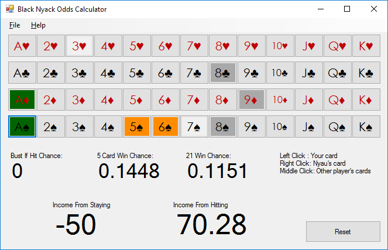

# Black Nyack Odds Calculator
Phantasy Star Online 2 has a minigame called Black Nyack that's similar to Blackjack, but the rules are slightly different, such that in many scenarios you may want to hit on 20! This program calculates the odds by simulating thousands of games, and tells you on average what your payout will be if you hit or stay.

Does it work? You tell me.

# How To Use
1. Left click on cards that are yours. Right click on cards that are Nyau's (the dealer). Middle click on cards belonging to other players.
2. Take a look at the Income From Staying / Hitting numbers. This represents on average what you stand to gain or lose by performing that action. -50 indicates that no matter what, this action means you're going to lose.
3. When the round is over, click "Reset" to clear the cards to start again.
4. Remember that sometimes you will lose, no matter what. Indeed, if you follow the advice of this program, you will almost certainly lose more often than if you play according to normal Blackjack strategies. But you will hit those massive 500+ coin payouts more often, meaning that overall you will make more coins per hour than any other strategy.

# Known Issues

* This program does not attempt to model wild cards at all. During development, I found that trying to enter that information as other cards are dealt in real-time was just too difficult. You've got a few seconds to click on all these cards, and trying to model the sequence of what your wild cards are worth as more wild cards are dealt is a pain. My advice when you get these cards is generally to stay - the bonus you get from having these cards far outweighs the losses you'll incur from the dealer beating you most of the time. Remember that Nyau will often bust trying to beat other players, so the odds of you losing from a low hand are significantly less than normal Blackjack.

* Similarly, this program does not model doubling down. This option removes getting the 5 card bonus, which is a massive number of coins. Over time, this strategy will yeild a lower payout per hour than playing optimally with exclusively hitting or staying.

* This entire program was hacked together in a couple hours. It took me more time to document it and post it on GitHub than it took to write. The code is a mess, and you may be driven to madness if you gaze upon the abomination contained within.

# Contribute
If there's some functionality missing, please feel free to [add an issue](https://github.com/software-2/BlackNyack/issues) describing your needs and suggestions.
